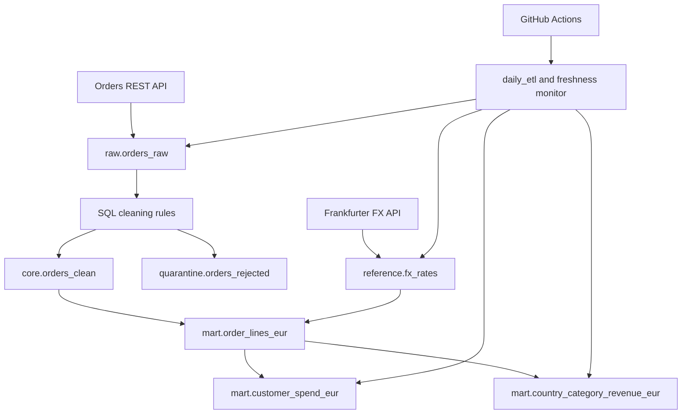

# E-commerce FX ETL Pipeline

[](https://github.com/rlzv/ecommerce-fx-etl-pipeline/actions/workflows/ci.yml)

An end-to-end data engineering project that ingests inconsistent e-commerce order lines,
preserves the source data, cleans and quarantines records with auditable rules, loads daily
RON/EUR exchange rates, and builds analytical PostgreSQL tables in EUR.

The project emphasizes production-oriented Python and SQL: typed transformations, explicit
data-quality decisions, idempotent loads, reconciliation checks, operational metadata,
scheduled execution, and independent freshness monitoring.

## Results

Validated locally and against a hosted Supabase PostgreSQL database on 2026-08-25:

| Metric | Result |
|---|---:|
| Raw order lines | 9,268 |
| Distinct source payloads | 9,085 |
| Exact duplicate copies | 183 |
| Clean order lines | 8,787 |
| Quarantined order lines | 481 |
| Completed clean lines | 8,389 |
| Refunded clean lines | 398 |
| Customer mart rows | 1,868 |
| Currently resolved customer spend | EUR 702,602.02 |
| Qualifying country rows | 2 |
| Qualifying Books/Electronics revenue | EUR 183,511.14 |
| Automated tests | 61 |

Future FX reference dates remain pending. Therefore, resolved revenue is intentionally partial
until those dates arrive and the daily pipeline loads the corresponding rates.

## Architecture



PostgreSQL schemas separate responsibilities:

| Schema | Responsibility |
|---|---|
| `raw` | Lossless source landing data and ingestion metadata |
| `reference` | Canonical product mappings and FX rates |
| `core` | Typed, repaired, deduplicated production orders |
| `quarantine` | Rejected rows with one or more explicit reasons |
| `mart` | Auditable EUR conversions and analytical outputs |
| `ops` | Pipeline runs, errors, metrics, migrations, and quality results |

See [Architecture](docs/architecture.md) for lineage, transaction boundaries, idempotency, and
design tradeoffs.

## Technology

- Python 3.12–3.14
- PostgreSQL 17
- SQL transformations and versioned migrations
- Docker Compose for local PostgreSQL
- Supabase PostgreSQL for hosted execution
- GitHub Actions for CI, daily execution, and monitoring
- Pytest, Ruff, mypy, and data-quality SQL checks
- Frankfurter v2 for historical RON/EUR rates

## Local setup

Copy the environment template and insert the publishable source API key into `.env`:

```bash
cp .env.example .env
```

Start PostgreSQL:

```bash
docker compose up -d postgres
docker compose ps
```

Create and activate a virtual environment on Windows Git Bash:

```bash
python -m venv .venv
source .venv/Scripts/activate
python -m pip install --upgrade pip
python -m pip install -e ".[dev]"
```

Apply migrations and verify the database connection:

```bash
ecommerce-etl db-check
ecommerce-etl migrate
```

## Run the pipeline

Run every stage in dependency order:

```bash
ecommerce-etl run-pipeline
```

The command performs:

1. Versioned database migrations
2. Paginated, lossless orders ingestion
3. SQL cleaning, repair, deduplication, and quarantine
4. Required RON/EUR rate ingestion
5. Line-level conversions and customer-spend aggregation
6. Ranked Books/Electronics revenue by country

Every stage can also run independently:

```bash
ecommerce-etl ingest-orders
ecommerce-etl clean-orders
ecommerce-etl ingest-fx
ecommerce-etl refresh-customer-spend
ecommerce-etl refresh-country-revenue
```

## Cleaning decisions

The cleaning transformation is transactional and auditable. It:

- keeps the first copy of an exact source payload and quarantines later copies;
- quarantines test orders, invalid quantities, non-positive prices, and unsupported values;
- detects extreme positive prices using a per-product/per-currency median baseline and a
  conservative `unit_price > 10 × median` threshold;
- parses ISO, Unix-second, and `DD/MM/YYYY HH:MM` timestamps as UTC;
- repairs missing customer IDs from unambiguous normalized-email mappings;
- creates one explicitly flagged deterministic email-based surrogate where no source ID exists;
- repairs categories and malformed SKUs from a canonical product catalog;
- retains refunded orders in `core.orders_clean` while revenue marts use completed orders only.

The downstream mart review exposed 13 `999999` prices that passed the initial positive-price
rule. They are now quarantined as `implausible_unit_price_outlier`; the maximum accepted price
is 207.87. This prevents plausible-looking but materially incorrect revenue.

See [Data quality](docs/data-quality.md) for counts, overlapping rejection reasons, repair rules,
and limitations.

## FX and revenue rules

For every completed order line:

```text
source_amount = quantity × unit_price
```

- EUR uses an identity rate of `1`.
- Due RON lines use the latest available rate on or before `fx_reference_date`.
- An exact-date rate is preferred; weekends and holidays may use the latest prior rate.
- Future reference dates remain `pending`; the pipeline never substitutes today's rate.
- Refunded, test, invalid, duplicate, and quarantined lines do not contribute to revenue.

`mart.order_lines_eur` preserves the requested date, applied date, rate, conversion method,
source amount, and EUR amount. `mart.customer_spend_eur` exposes customer totals and completion
state. `mart.country_category_revenue_eur` includes only Books/Electronics country totals above
EUR 40,000 and ranks them deterministically by resolved revenue.

## Automation and monitoring

Local health check:

```bash
ecommerce-etl check-freshness --max-age-hours 26
```

Hosted workflows:

- `daily-pipeline.yml`: daily at 06:15 UTC and manual dispatch.
- `freshness-monitor.yml`: immediately after daily completion and independently at 09:00 UTC.
- CI: Python 3.12 and 3.14 on pull requests and pushes to `develop` or `main`.

The later independent monitor detects a completely missed GitHub schedule on the same day,
while `workflow_run` detects an explicit failure immediately. A PostgreSQL advisory transaction
lock prevents overlapping end-to-end runs. GitHub repository secrets provide `DATABASE_URL` and
`ORDERS_API_KEY`; neither secret belongs in source control.

See [Monitoring and runbook](docs/monitoring.md) for failure detection, triage queries,
production alerting, and limitations.

## Validation

```bash
ruff check .
ruff format --check .
mypy src
pytest
```

The pipeline also writes critical runtime checks to `ops.data_quality_results`, including row
reconciliation, required fields, duplicate payloads, FX coverage, non-negative amounts,
customer identity consistency, revenue reconciliation, threshold enforcement, and rank order.

## Hosted deployment

The hosted database uses the Supabase Session pooler because GitHub-hosted runners require an
IPv4-compatible PostgreSQL endpoint. Configure these repository secrets:

```text
DATABASE_URL
ORDERS_API_KEY
```

Scheduled workflows run from GitHub's default branch. Merge `develop` into `main` only after CI,
local validation, hosted validation, and documentation review.

## Documentation

- [Project writeup](docs/project-writeup.md)
- [Architecture](docs/architecture.md)
- [Data quality](docs/data-quality.md)
- [Monitoring and runbook](docs/monitoring.md)
- [AI usage](docs/ai-usage.md)

## Branching

Features and fixes are developed from `develop`, validated locally, and merged through pull
requests. `develop` is the integration branch; `main` contains the release-ready version and
activates scheduled workflows.

## Security

- `.env` is ignored by Git.
- `.env.example` contains placeholders only.
- Hosted credentials are GitHub Actions secrets.
- Logs and documentation contain no database passwords or connection strings.
- The source API uses its assignment-provided publishable key; destination database credentials
  are separate.

## License

MIT
