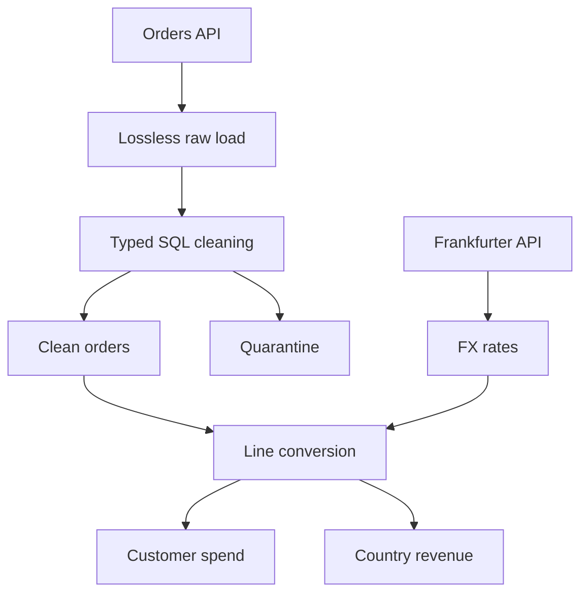
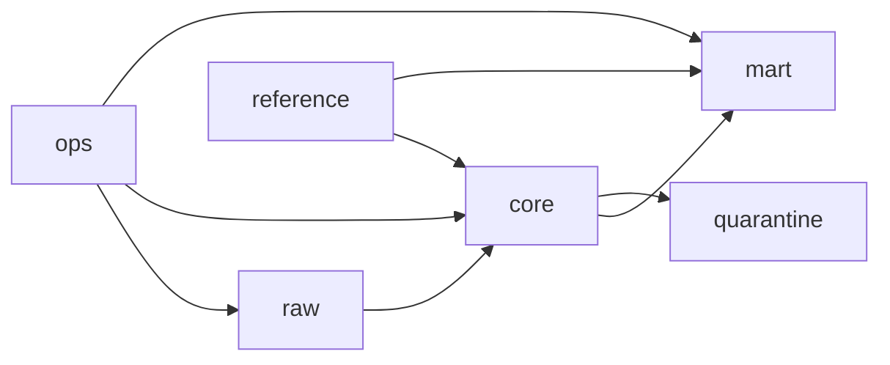
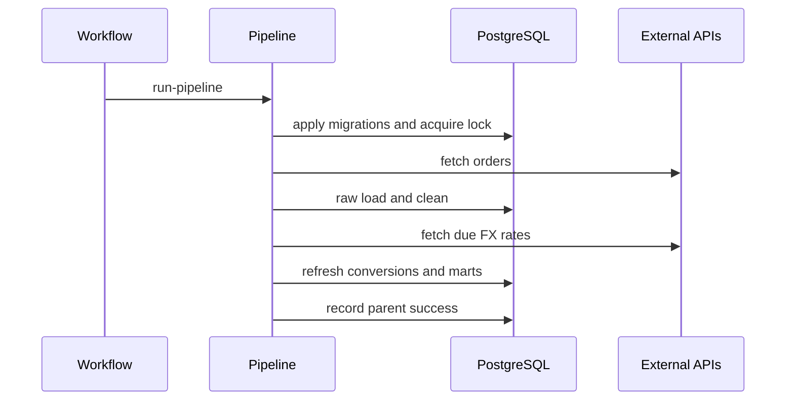

# Architecture

## Data flow

The line-level EUR mart is the shared audited conversion layer. Both analytical outputs consume
the same rounded line amounts, preventing separate queries from implementing slightly different
FX rules.

## Components

| Component | Responsibility |
|---|---|
| `clients/orders_client.py` | Paginated REST extraction with timeout, retry, and source-key authentication |
| `ingestion.py` and loader | Canonical hashes, occurrence preservation, and idempotent raw upserts |
| `clean_orders.sql` | Types, repairs, rejection reasons, deduplication, and transactional table refresh |
| `clients/frankfurter_client.py` | Historical RON/EUR range extraction |
| `fx_ingestion.py` | Required-date window, rate upserts, future-date state, and coverage checks |
| `refresh_customer_spend.sql` | Audited line conversions and customer aggregation |
| `refresh_country_category_revenue.sql` | Category filter, EUR 40,000 threshold, and deterministic ranking |
| `pipeline.py` | Dependency order, parent audit record, fail-fast behavior, and overlap lock |
| `freshness.py` | Independent database-state and mart-freshness validation |

## Database layers

- `raw.orders_raw` preserves each API object as JSONB with ingestion metadata.
- `reference.product_catalog` provides deterministic SKU/category repairs.
- `reference.fx_rates` stores source/target currency, date, rate, and provider.
- `core.orders_clean` contains accepted typed records and `data_repairs`.
- `quarantine.orders_rejected` preserves original payloads and rejection arrays.
- `mart.order_lines_eur` records conversion lineage.
- `mart.customer_spend_eur` and `mart.country_category_revenue_eur` are consumer tables.
- `ops` records migrations, executions, errors, metrics, and data-quality results.

## Execution order

Each stage has its own database transaction and operational run record. The entire pipeline is
not one long transaction across external API calls: if a late stage fails, earlier successful
work remains visible and auditable. Because every stage is idempotent, a full rerun safely
reconciles the database.

## Idempotency and concurrency

- Raw identity is `(source_record_hash, source_occurrence)`, preserving duplicate copies without
  inserting additional rows on a repeated snapshot load.
- Reference rates upsert by date and currency pair.
- Clean, quarantine, and marts refresh transactionally.
- Migrations are versioned and recorded in `ops.schema_migrations`.
- Stage-specific advisory locks prevent concurrent refreshes.
- The parent pipeline holds a PostgreSQL advisory transaction lock for the end-to-end run.
- GitHub workflow concurrency adds a second protection layer.

## FX state model

| Method | Meaning |
|---|---|
| `identity` | EUR line, rate 1 |
| `exact` | RON rate date equals requested reference date |
| `prior` | Latest earlier rate used for a weekend/holiday |
| `pending` | Reference date is in the future |
| `unavailable` | Due date has no usable rate; treated as a critical failure |

## Tradeoffs

- Full table refreshes are appropriate for 9,268 static source rows and make reconciliation easy.
  At production scale, use incremental models, partitions, and change capture.
- PostgreSQL plus GitHub Actions keeps the exercise reproducible and inexpensive. A larger
  deployment would use Airflow, Dagster, or Prefect for richer dependencies, retries, backfills,
  and alerts.
- The product catalog is derived from deterministic source relationships. A production catalog
  should be an independently governed master-data source.
- Country mart qualification currently uses resolved revenue. Pending FX can later change
  membership and rank, which is why completeness is exposed and the mart refreshes daily.
